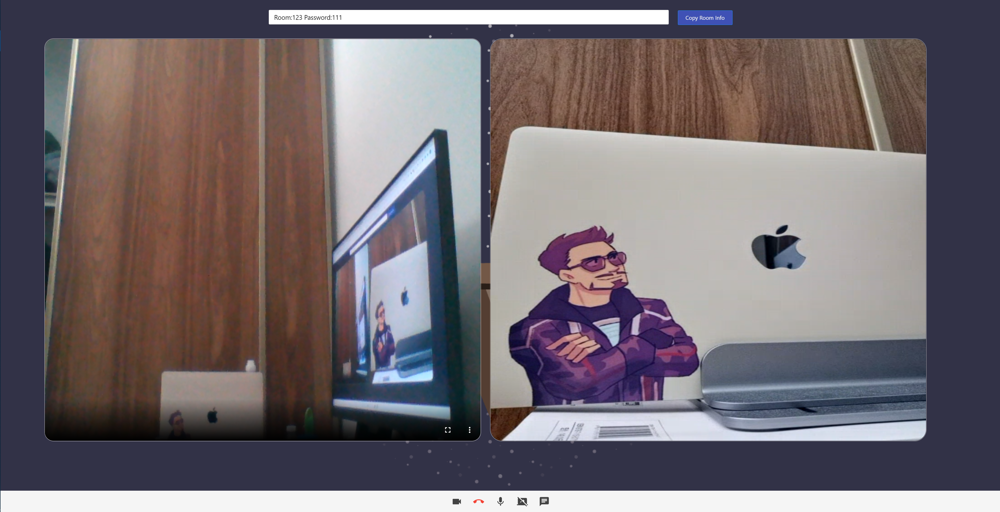
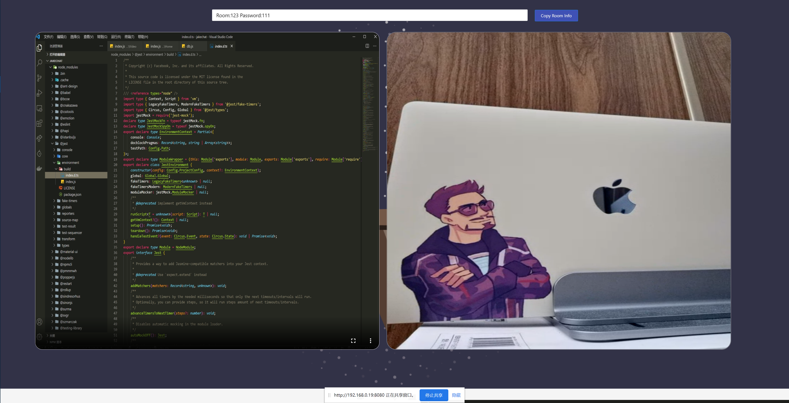
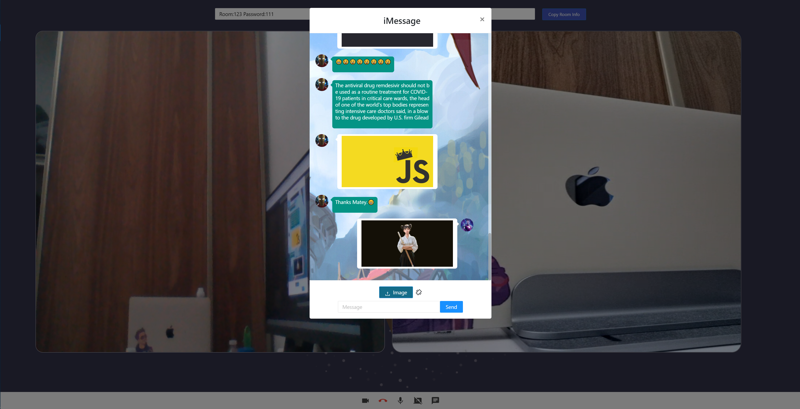
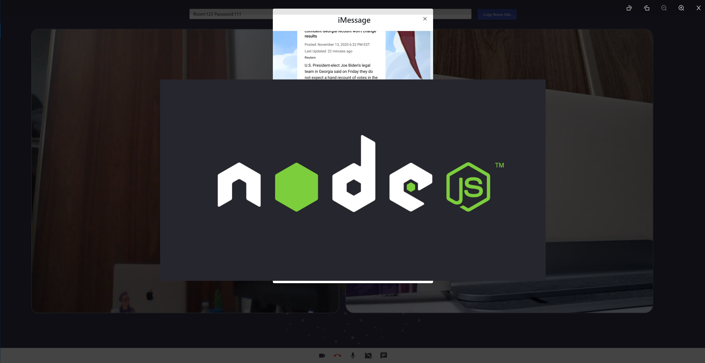

# Video Meeting with WebRTC


### Deployment

Implemented reverse proxy deployment utilizing **Nginx** in the **Vultr** cloud server. 

Address: https://fleetingsound.org


### Short Description

This is a dynamic Video Meeting & Chat Application built with **React**,**Socket.io** and **Express**.


### What is WebRTC

With WebRTC, you can add real-time communication capabilities to your application that works on top of an open standard. It supports video, voice, and generic data to be sent between peers, allowing developers to build powerful voice- and video-communication solutions. The technology is available on all modern browsers as well as on native clients for all major platforms. 


### Features

- Creating video meeting rooms for real-time video chat.
- Supported sending images, emoji and window’s shake in the chat module. 
- Provided full screen and floating video functions.
- l Implemented independent controls for video, voice, and screen sharing functions.
- Without using Database, provide rapid deployment.
- conversation bubble and user avatars.
- Provided full device adaptation of user’s interface by utilizing React-strap’s components.
- Quick copy room information with one click.


### Todo List...

+ Sound notification.
+ User-oriented avatar list
+ ...


### Stack

- Back End Framework: [Express](https://expressjs.com/)
- Front End Framework: [React](https://reactjs.org/)
- Real-Time Engine: [Socket.IO](https://www.npmjs.com/package/socket.io) & [Socket.IO-Client](https://www.npmjs.com/package/socket.io-client) 
- UI Components: [Material-UI](https://material-ui.com/) & [Ant Design](https://ant.design/components/overview/)
- Styling: [styled-components](https://styled-components.com/)
- Code Formatting: [Prettier](https://prettier.io/)


### Run

```js
//1. install the depencies
> yarn

//2. Run 
>npm run dev
```


#### Screen-Shots

+ Login 

  

+ Video Meeting Room

  


+ Screen Share

  

+ Messages

  


+ View original photo & Download

  


