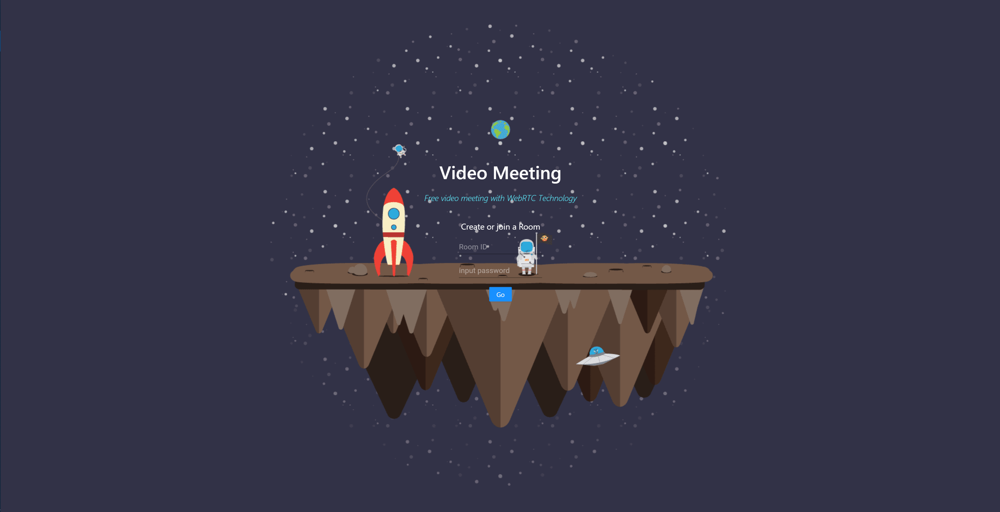
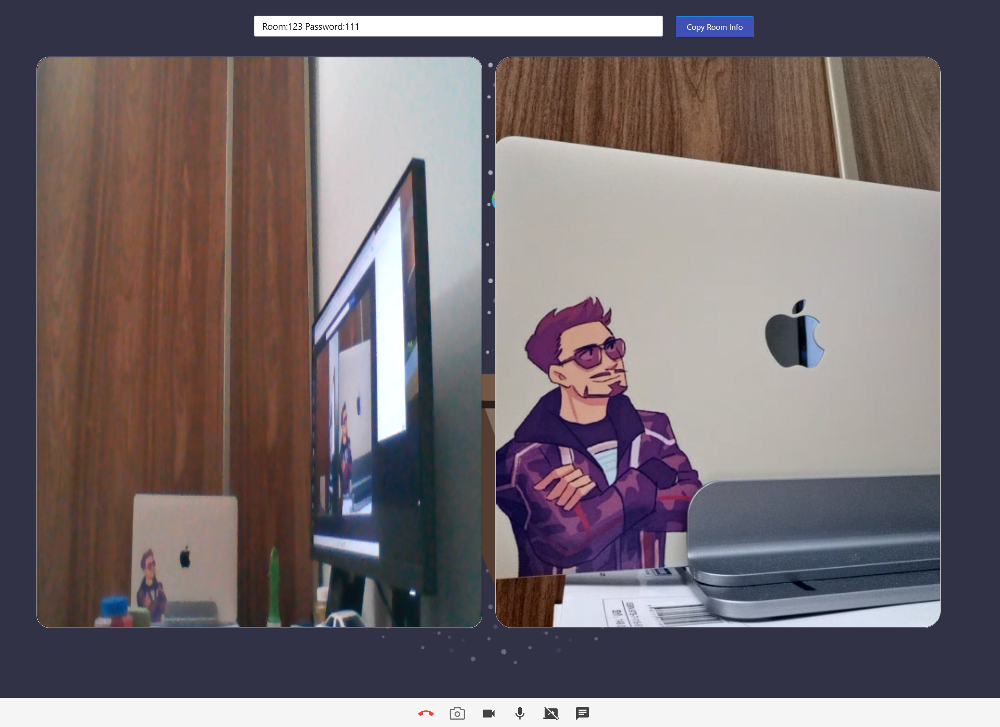

# Video Meeting with WebRTC


### Deployment

Implemented reverse proxy deployment utilizing **Nginx** in the **Vultr** cloud server. 

Address: https://www.fleetingsound.org


### Short Description

This is a dynamic Video Meeting & Chat Application built with **React**,**Socket.io** and **Express**.


### What is WebRTC

With WebRTC, you can add real-time communication capabilities to your application that works on top of an open standard. It supports video, voice, and generic data to be sent between peers, allowing developers to build powerful voice- and video-communication solutions. The technology is available on all modern browsers as well as on native clients for all major platforms. 


### Features

- Creating video meeting rooms for real-time video chat.
-  User information list.
- The messages list is **cleared immediately** after all users leave chatroom, protected user privacy.
- Complete authorization detection.
- Support one-click **screenshot** function
- Unique room name & password & user avatar. 
- Supported sending images, emoji and window’s shake in the chat module. 
- Provided full screen and floating video functions.
- Implemented independent controls for video, voice, and screen sharing functions.
- Lightweight deployment.
- conversation bubble and  unique user avatar.
- Provided full device adaptation of user’s interface by utilizing React-strap’s components.


### Stack

- Back End Framework: [Express](https://expressjs.com/)
- Front End Framework: [React](https://reactjs.org/)
- Real-Time Engine: [Socket.IO](https://www.npmjs.com/package/socket.io) & [Socket.IO-Client](https://www.npmjs.com/package/socket.io-client) 
- UI Components: [Material-UI](https://material-ui.com/) & [Ant Design](https://ant.design/components/overview/)
- Styling: [styled-components](https://styled-components.com/)
- Code Formatting: [Prettier](https://prettier.io/)


### Run

```js
//1. install the depencies
> cd ./FrontEnd 
> yarn

> cd ./Server
> yarn

//2. Run 
>cd ./Server
>npm run dev  
```


#### Screen-Shots

+ Login 

  

+ User Avatar

  


+ Video Meeting Room

  
  
  

+ Screen Share

  

+ Messages

  


+ View original photo & Download

  


